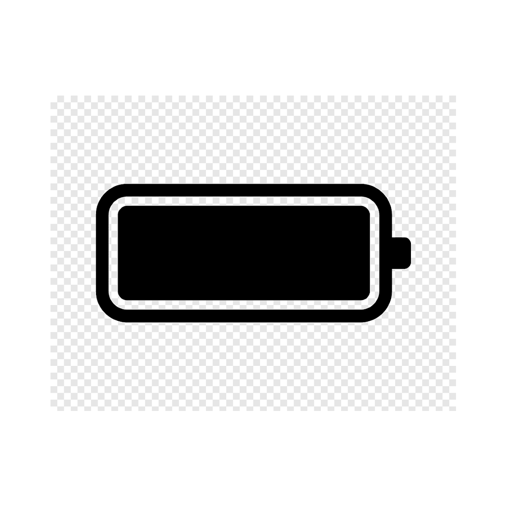

<div align="center">



# Battery Time

macOS menu bar app for real-time battery monitoring

[](https://www.apple.com/macos/)
[](https://swift.org)
[](LICENSE)
[](https://github.com/AbdullahMubeenAnwar/battery-time/releases/latest)

[Download](https://github.com/AbdullahMubeenAnwar/battery-time/releases/latest) · [Build from source](#build-from-source) · [Contributing](#contributing)

<br />

<video src="Assets/demo.mp4" autoplay loop muted playsinline width="760"></video>

</div>

<br />

## Overview

Battery Time lives in your menu bar and gives you a clear picture of your battery right now. It tracks drain rates and health diagnostics without relying on iCloud or any external services.

No subscriptions. No telemetry. Fully open source.

<br />

## Features

**Menu bar**
- Six display modes: icon only · percentage · time remaining · both · inner percentage · charger outside
- Colorized fill (green / orange / red) based on charge level
- Optional XL size
- Hides additional info when battery is full

**Estimates**
- Rolling 10 / 30 / 60-minute drain and charge rates computed from your own usage
- Falls back to the macOS system estimate when not enough data is available

**Health & diagnostics**
- Cycle count, maximum capacity, battery condition
- Temperature, adapter wattage, charging limit
- Top energy-consuming processes right now

<br />

## Install

### Download *(recommended)*

1. Go to [**Releases**](https://github.com/AbdullahMubeenAnwar/battery-time/releases/latest)
2. Download `BatteryTime-x.x.dmg`
3. Open the DMG → drag Battery Time to Applications
4. Launch and the battery icon appears in your menu bar

Requires **macOS 13 (Ventura)** or later. Liquid glass UI is shown on macOS 26 (Tahoe); older versions use a material fallback.

### Homebrew

> Homebrew Cask coming soon.

<br />

## Build from source

**Requirements:** macOS 13+ · Xcode Command Line Tools (no full Xcode needed)

```bash
git clone https://github.com/AbdullahMubeenAnwar/battery-time.git
cd battery-time

# Build and launch
./script/build_and_run.sh

# Build a release DMG → release/BatteryTime-x.x.dmg
./script/build_dmg.sh
```

Additional build modes:

```
./script/build_and_run.sh debug      build + attach lldb
./script/build_and_run.sh logs       launch + stream os_log
./script/build_and_run.sh verify     launch + confirm started
```

<br />

## Architecture

Zero third-party dependencies. Only Apple frameworks.

```
BatteryTimeAppModel
├── BatteryMonitor              ObservableObject, polls IOKit every 60 s
│   ├── PowerSourceClient       reads live data from IOKit
│   ├── BatteryEstimator        rolling 10 / 30 / 60-min drain rates
│   └── ProcessSampler          top energy-consuming processes
├── BatteryStatusItemController menu bar icon + popover
└── MainWindowController        main window
```

Frameworks: `SwiftUI` `AppKit` `IOKit` `ServiceManagement`

<br />

## Contributing

Bug reports and pull requests are welcome. For major changes please open an issue first.

```bash
git clone https://github.com/AbdullahMubeenAnwar/battery-time.git
cd battery-time
./script/build_and_run.sh
```

<br />

## License

[MIT](LICENSE) © 2026 Muhammad Abdullah
